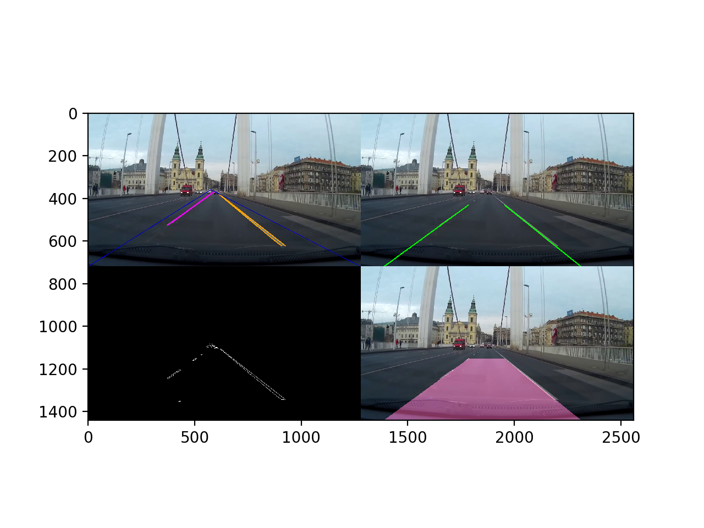

# Workshop #1

For JavaScript setup [click here](js_start/)

## Setup for python

The following packages are used in this project:

* matplotlib.pyplot
* scipy
* moviepy
* numpy
* cv2

The easiest way to create a working environment is to install [miniconda](https://conda.io/miniconda.html) and run the following command to install the packages specified in the `environment.yml` file.

`sudo conda env create -f environment.yml`

After success, activate the environment:

`source activate bpcar`	

and run the demo:

`python lanes1.py`

If you see something like this, you are good!
Then comment out in `lanes1.py` the `img_test()` function and run instead `video_test()`. Your script should output a video.

## The challenge

As you can see, `lanes1.py` processes individual images or a video frame-by-frame.

In this demo this is done by a function called `pipeline`. The function gets an image _(y * x * 3 numpy array)_ and returns another image _(y * x * 3 numpy array)_.

You can also pass this function to a `moviepy` clip instance's `fl_image` method, so it filters every frame of the clip using this function.

### Your task

Your task is to replace the `pipeline` function with your own frame-processing function, created from scratch.

*Good luck!*

